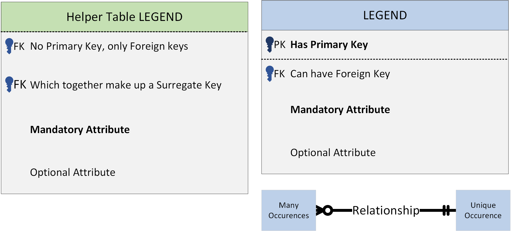
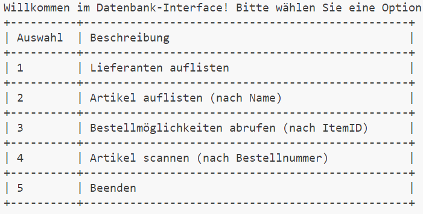
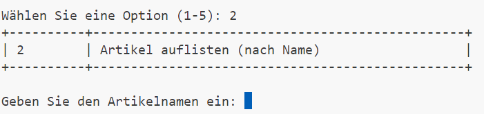

# SQLite Project
Beschreibung ``SQLite`` Projekt von Python Grundlagen

## Beschrieb Datenbank
Wir kreiiren ein **Lager-System** welches alle Bauteile einer Firma beinhaltet. 

**Jedes Bauteil** der Firma wird in der **Tabelle `Inventory`** gespeichert. Diese Tabelle hat:
- `itemID`: eine einzigartige (firmen-interne) Nummer
- `namen`: Beschreibt was das Bauteil ist
- `category`: Eine von wenigen Bauteil Kategorien
- `units`: Wie viel davon noch auf Lager ist


Zudem hat die Firma **eine Liste von Lieferanten.** Diese Information ist in der Tabelle `Vendors` gespeichert. Diese hat:  
- `vendorID`: eine einzigartige (firmen-interne) Nummer eines Lieferanten
- `name`: Namen des Lieferanten

Da Bauteile **von verschiedenen Lieferanten bestellt werden können**, muss diese Information ebenfalls gespeichert werden. Dies wird mittel einer der `OrderLookup` **Helfer-Tabelle** gemacht. Diese hat:
- `itemID`: ID des Bauteils (PK mit `itemID`)
- `vendorID`: Lieferant des Bauteils (PK mit `itemID`)
- `orderNr`: Spezifische Bestellnummer vom Bauteil beim Lieferanten
- `price`: Preis des Bauteiles beim Lieferanten

### ER - Diagramm


<div style="text-align: center;">

</div>

#### Legende

<div style="text-align: center;">

</div>

## Datenbank Interface

Dieses Projekt bietet ein **Python-User-Interface (UI)** zur Interaktion mit einer Datenbank, die **einfache Abfragen und Verwaltung** von Inventar- und Bestellinformationen ermöglicht.

Dieses `Python UI` ist bereits vorimplementiert (**`DatabaseInterface` Klasse**) und ermöglicht das Anwählen von verschiedenen Abfragen der Datenbank via ``CommandLine``:

<div style="text-align: center;">

</div>


Zudem verfügt die `DatabaseInterface` Klasse über (noch fast leere) **Methoden**, welche ausgeführt werden, wenn eine bestimmte Auswahlen getroffen wird:


<div style="text-align: center;">

</div>

## Zu implementierende Funktionen

Implementieren / vervollständigen sie folgende Funktionen im Python Interface: (Mit `# TODO` gekenntzeichnet)


## 1 ``list_vendors()``
Gibt eine Liste von allen Lieferanten und deren `ID`, `Name` und `URL` aus.

**Beispiel:**

```python
list_vendors()
```
**Mögliche Ausgabe**:

```
|------------|--------------------|------------------|
| VendorID   | Name               | URL              |
|------------|--------------------|------------------|
| 0001       | Mouser             | www.mouser.ch    |
| 0002       | Distrelec          | www.distrelec.ch |
| 0003       | Digikey            | www.digikey.ch   |
|------------|--------------------|------------------|
```

## 1. ``list_items(name)``

Gibt alle Artikel im Inventar aus, die den angegebenen ``name`` im Namen enthalten. 

**Beispiel:**

```python
list_items("Raspberry")
```

**Mögliche Ausgabe**:

```
|---------|--------------------|---------|
| ItemID  | Name               | Anzahl  |
|---------|--------------------|---------|
| 0001    | RaspberryPi 3      | 10      |
| 0002    | RaspberryPi 4      | 3       |
| 0007    | RaspberryPi Pico   | 7       |
|---------|--------------------|---------|
```

## 2. ``get_orders(itemID)``

Gibt alle **verfügbaren Bestelloptionen** für einen bestimmten Artikel anhand der ``itemID`` aus.

**Beispiel**:

```python
get_orders("0001")
```

**Mögliche Ausgabe**:

```
|-------------|-----------------|---------|
| Lieferant   | Bestellnummer   | Preis   |
|-------------|-----------------|---------|
| Distrelec   | 10-14-231       | 35.40   |
| Mouser      | 0001EAGAS       | 45.50   |
|-------------|-----------------|---------|
```
## 3. ``scan_item(orderNr)``

Ermöglicht das "Scannen" eines bestellten Artikels **anhand seiner ``orderNr``**, **aktualisiert den Bestand** und zeigt die neue Anzahl an.

**Beispiel**:

```python
scan_item("10-14-231")
```

**Mögliche Ausgabe**:

```
|---------|-----------------|---------|
| ItemID  | Name            | Anzahl  |
|---------|-----------------|---------|
| 0001    | RaspberryPi 3   | 11      |
|---------|-----------------|---------|
```
